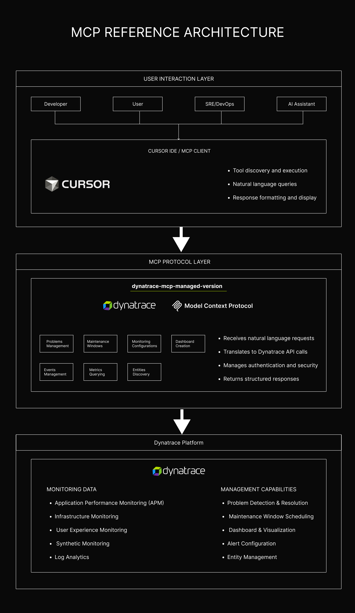

# Dynatrace MCP server - Managed Version
[](https://opensource.org/licenses/MIT)
[](https://nodejs.org/)
[](https://www.typescriptlang.org/)

> **Intelligent Dynatrace Management for Cursor IDE** - An MCP server that enables intelligent interaction with your Dynatrace Managed environment directly from your development environment.




## What is Dynatrace MCP Server?

The **Dynatrace MCP Server** is a Model Context Protocol (MCP) server built specifically for **Dynatrace Managed** environments. It enables intelligent interaction with your Dynatrace environment, allowing you to manage problems, monitor infrastructure, and automate maintenance operations directly from your IDE.

### Key Use Cases

- **Intelligent Problem Triaging** - Quickly identify, analyze, and resolve Dynatrace problems
- **Environment Management** - Monitor and manage your Dynatrace environment intelligently  
- **Maintenance Operations** - Schedule and manage maintenance windows with precision
- **Performance Analytics** - Query metrics and analyze performance data
- **Infrastructure Monitoring** - Monitor hosts, services, and applications
- **Dashboard Management** - Create and manage custom dashboards
- **Event Management** - Handle and analyze Dynatrace events

## Prerequisites

### Required
- **Node.js** 18.0.0 or higher
- **Cursor IDE** with MCP support
- **Dynatrace Managed** environment access
- **Valid Dynatrace API Token** with appropriate permissions

### API Token Permissions
Your Dynatrace API token needs the following permissions:
- **Read problems** - View and analyze problems
- **Write problems** - Close problems and add comments
- **Read entities** - Access host and service information
- **Read metrics** - Query performance metrics
- **Read events** - Access event data
- **Write events** - Create custom events
- **Read settings** - Access configuration data
- **Write settings** - Modify monitoring settings

## Quick Start

### 1. Clone the Repository
```bash
git clone https://github.com/deepak-101-dev/dynatrace-mcp-managed-version.git
cd ManagedDynatraceMCP
```

### 2. Install Dependencies
```bash
npm install
```

### 3. Configure Credentials
```bash
cp env.example .env
```

Edit your `.env` file with your Dynatrace credentials:
```env
DYNATRACE_API_TOKEN=your_dynatrace_api_token_here
DYNATRACE_ENV_URL=https://your-environment-id.live.dynatrace.com
```

### 4. Build the Project
```bash
npm run build
```

### 5. Configure MCP Server in Cursor

Copy the absolute path for `index.js` and add it to your Cursor settings `mcp.json`:

```json
{
  "mcpServers": {
    "DynatraceManagedMCP": {
      "command": "node",
      "args": [
        "<full path to your directory>\\dist\\index.js"
      ]
    }
  }
}
```

**Important:** Replace `<full path to your directory>` with your actual project path to the `dist/index.js` file.

### 6. Enable MCP Server in Cursor
- Open Cursor settings
- Navigate to MCP settings  
- Enable the `DynatraceManagedMCP` server
- Restart Cursor if needed

### 7. Start Using!
The MCP server is now active in Cursor. You can:
- Ask Cursor to fetch problems: *"Show me problems from the last hour"*
- Request environment analysis: *"Get CPU usage for production hosts"*
- Manage maintenance: *"Create a maintenance window for server updates"*

## Capabilities

This MCP server provides **38+ powerful tools** across 7 categories, all running **locally** on your machine. The server operates entirely within your development environment, ensuring:

- **Zero Latency** - Direct communication with your Dynatrace environment
- **Enhanced Security** - No data leaves your local environment
- **Full Control** - Complete control over your monitoring and management operations
- **Real-time Insights** - Immediate access to your Dynatrace data

### Core Capabilities
- **Problem Management** - Intelligent problem triaging and resolution
- **Maintenance Operations** - Automated maintenance window management
- **Infrastructure Monitoring** - Real-time host and service monitoring
- **Performance Analytics** - Advanced metrics querying and analysis
- **Dashboard Management** - Custom dashboard creation and management
- **Event Management** - Comprehensive event handling and analysis
- **Entity Discovery** - Intelligent entity management and filtering

## Cost

**This MCP server is completely FREE to use!** 

- **No MCP Server Costs** - The server itself is open source and free
- **No Dynatrace API Costs** - All API calls use the standard Dynatrace managed APIs with no additional charges assigned to them
- **No Environment Impact** - Using this MCP server will not affect your Dynatrace environment or incur any additional costs

## AI Assistant Powers

The MCP server enables your AI assistant to perform sophisticated operations with **no fluff or misleading information** as it operates directly on the context of your Dynatrace environment:

### Intelligent Problem Management
- **Automated Triaging** - AI can analyze problem severity and impact automatically
- **Root Cause Analysis** - Deep understanding of problem relationships and dependencies
- **Smart Resolution** - AI can suggest and implement resolution strategies
- **Context-Aware Comments** - Intelligent problem documentation and communication

### Advanced Monitoring Operations
- **Predictive Analysis** - AI can identify patterns and predict potential issues
- **Performance Optimization** - Intelligent recommendations for system improvements
- **Capacity Planning** - AI-driven insights for resource allocation
- **Anomaly Detection** - Advanced pattern recognition for unusual behavior

### Automated Maintenance
- **Smart Scheduling** - AI can optimize maintenance windows based on usage patterns
- **Risk Assessment** - Intelligent evaluation of maintenance impact
- **Automated Coordination** - AI can coordinate complex maintenance operations
- **Impact Analysis** - Real-time assessment of maintenance effects

## Key Usage

### Problem Management
- **Incident Response** - Rapid problem identification and resolution
- **Root Cause Analysis** - Deep dive into problem origins and relationships
- **Automated Triaging** - Intelligent problem prioritization and assignment
- **Resolution Tracking** - Comprehensive problem lifecycle management

### Infrastructure Monitoring
- **Real-time Health Checks** - Continuous monitoring of system health
- **Performance Optimization** - AI-driven performance improvement recommendations
- **Capacity Management** - Intelligent resource allocation and planning
- **Anomaly Detection** - Advanced pattern recognition for unusual behavior

### Maintenance Operations
- **Planned Maintenance** - Intelligent scheduling of maintenance windows
- **Change Management** - Coordinated system updates and modifications
- **Risk Mitigation** - Proactive identification of potential issues
- **Automated Coordination** - AI-driven maintenance workflow management

## Features

### 38+ Powerful Tools across 7 categories:

#### Problem Management (8 tools)
- **Problem Discovery** - Find and analyze problems across your environment
- **Problem Details** - Get comprehensive problem information and root cause analysis
- **Problem Resolution** - Close problems and add contextual comments
- **Comment Management** - Add, update, and manage problem comments
- **Problem Filtering** - Filter problems by status, severity, and timeframes

#### Maintenance Windows (6 tools)
- **Maintenance Scheduling** - Create and manage maintenance windows
- **Temporary Tagging** - Create temporary tags for maintenance filtering
- **Window Management** - Enable/disable maintenance windows
- **Host & Application Filtering** - Target specific hosts and applications

#### Host Monitoring (7 tools)
- **Host Configuration** - Get and update host monitoring settings
- **Monitoring Control** - Enable/disable monitoring for specific hosts
- **Anomaly Detection** - Configure CPU, memory, and disk thresholds
- **Host Discovery** - Find hosts by tags, groups, and Kubernetes clusters

#### Dashboard Management (5 tools)
- **Dashboard Creation** - Create custom dashboards with tiles
- **CPU Usage Dashboards** - Specialized CPU monitoring dashboards
- **Dashboard Management** - List, update, and manage existing dashboards
- **Tile Configuration** - Configure dashboard tiles and metrics

#### Event Management (7 tools)
- **Event Discovery** - List and filter Dynatrace events
- **Event Details** - Get comprehensive event information
- **Custom Events** - Ingest custom events into Dynatrace
- **Event Properties** - Manage event properties and types

#### Metrics & Analytics (2 tools)
- **Metric Discovery** - List available metrics with filtering
- **Metric Querying** - Query timeseries data for analysis

#### Entity Management (3 tools)
- **Entity Discovery** - Find entities by tags and filters
- **Host Group Management** - Manage host groups and clusters
- **Kubernetes Integration** - Discover Kubernetes entities

## Setup and Configuration

### Environment Configuration

1. **Clone the Repository**
   ```bash
   git clone https://github.com/deepak-101-dev/dynatrace-mcp-managed-version.git
   cd ManagedDynatraceMCP
   ```

2. **Install Dependencies**
   ```bash
   npm install
   ```

3. **Configure Environment Variables**
   ```bash
   cp env.example .env
   ```
   
   Edit your `.env` file:
   ```env
   DYNATRACE_API_TOKEN=your_dynatrace_api_token_here
   DYNATRACE_ENV_URL=https://your-environment-id.live.dynatrace.com
   LOG_LEVEL=info
   ENABLE_DEBUG_LOGGING=true
   ```

4. **Build the Project**
   ```bash
   npm run build
   ```

5. **Configure Cursor MCP**
   
   Add to your Cursor settings `mcp.json`:
   ```json
   {
     "mcpServers": {
       "DynatraceManagedMCP": {
         "command": "node",
         "args": [
           "<full path to your directory>\\dist\\index.js"
         ]
       }
     }
   }
   ```

### Development Setup

```bash
# Development mode with auto-rebuild
npm run dev

# Build for production
npm run build

# Lint code
npm run lint
npm run lint:fix

# Clean build artifacts
npm run clean
```

## Tools and Categories

### Problem Management Tools
- `get_problems` - Fetch problems with filtering options
- `get_problem_details` - Get detailed problem information
- `close_problem` - Close problems with resolution comments
- `get_problem_comments` - Retrieve problem comments
- `add_problem_comment` - Add new comments to problems
- `update_problem_comment` - Update existing comments
- `delete_problem_comment` - Remove problem comments
- `get_problem_comment` - Get specific comment details

### Maintenance Window Tools
- `create_maintenance_window` - Create new maintenance windows
- `create_temp_tag` - Create temporary tags for filtering
- `list_maintenance_windows` - List all maintenance windows
- `toggle_maintenance_window` - Enable/disable maintenance windows
- `delete_maintenance_window` - Remove maintenance windows
- `get_maintenance_window_details` - Get detailed maintenance window info

### Host Monitoring Tools
- `get_host_monitoring_details` - Get host monitoring configuration
- `get_host_monitoring_settings` - Get host-level monitoring settings
- `update_host_monitoring_settings` - Update host monitoring configuration
- `enable_host_monitoring` - Enable monitoring for hosts
- `disable_host_monitoring` - Disable monitoring for hosts
- `get_host_anomaly_thresholds` - Get anomaly detection thresholds
- `update_host_anomaly_thresholds` - Update anomaly detection settings

### Dashboard Management Tools
- `create_dashboard` - Create empty dashboards
- `create_dashboard_with_tiles` - Create dashboards with configured tiles
- `create_cpu_usage_dashboard` - Create specialized CPU monitoring dashboards
- `get_dashboard_details` - Get detailed dashboard information
- `list_dashboards` - List all available dashboards

### Event Management Tools
- `get_events` - List events with filtering options
- `get_event_details` - Get detailed event information
- `ingest_custom_event` - Create custom events
- `get_event_properties` - List available event properties
- `get_event_property_details` - Get specific event property details
- `get_event_types` - List available event types
- `get_event_type_details` - Get specific event type information

### Metrics and Analytics Tools
- `list_metrics` - List available metrics with filtering
- `query_metric` - Query timeseries data for analysis

### Entity Management Tools
- `get_entities_by_tag` - Find entities by tags
- `get_hosts_by_host_group` - Get hosts by host group
- `get_entities_by_kubernetes_cluster` - Get entities by Kubernetes cluster

## Examples

### Problem Management Examples

**Get and analyze problems:**
```
"Show me all open problems from the last 2 hours and analyze their impact"
```

**Problem triaging:**
```
"Get problem P-12345, understand its root cause, and suggest resolution steps"
```

**Automated problem resolution:**
```
"Close problem P-12345 with a comment explaining the fix and add it to our knowledge base"
```

### Monitoring and Analysis Examples

**Get monitoring details and update:**
```
"Get monitoring details for host 'prod-server-01' and update its anomaly detection thresholds"
```

**Debug scenarios:**
```
"Analyze the request flow for the payment service and identify performance bottlenecks"
```

**Trace request flow:**
```
"Trace the complete request flow for user ID 12345 from login to checkout"
```

### Maintenance Operations Examples

**Create maintenance window:**
```
"Create a maintenance window for database updates from 2 AM to 4 AM UTC for all production hosts"
```

**Kubernetes cluster analysis:**
```
"Analyze Kubernetes cluster events for the 'production' cluster and identify any issues"
```

**Memory usage correlation:**
```
"Correlate memory usage spikes with application deployments in the last 24 hours"
```

### Dashboard Management Examples

**Dashboard management:**
```
"Create a comprehensive dashboard for production monitoring with CPU, memory, and disk usage"
```

**Host monitoring:**
```
"Set up monitoring for all hosts tagged with 'production' and configure alerting thresholds"
```

## Example Prompts

### Multi-Call Problem Management
```
"Get all problems from the last hour, understand their root causes, comment on possible fixes, and triage them by severity. For critical problems, suggest immediate actions."
```

### Monitoring and Maintenance
```
"Get monitoring details for all production hosts, update their anomaly detection settings, create a maintenance window for next weekend, and set up a dashboard to track the maintenance progress."
```

### Debug and Analysis
```
"Debug the performance issues in the payment service by tracing request flows, analyzing Kubernetes cluster events, correlating memory usage patterns, and creating a dashboard to monitor the resolution."
```

### Comprehensive Environment Management
```
"Analyze the entire production environment: get all problems, understand their impact, update monitoring settings, create maintenance windows, build dashboards, and provide a comprehensive health report."
```

## Future Roadmap

### Version 2.0 (Coming Soon)
- **Enterprise Proxy Support** - Full proxy configuration for enterprise environments
- **AI-Powered Insights** - Intelligent problem analysis and recommendations
- **Advanced Analytics** - Enhanced metrics analysis and trending
- **Smart Alerting** - Intelligent alert management and escalation
- **Custom Prompts** - Pre-built prompts for common operations
- **Multi-IDE Support** - Support for Claude and other IDEs
- **Multi-Environment** - Support for multiple Dynatrace environments
- **Performance Optimization** - Enhanced query performance and caching

### Additional Tools (Planned)
- **Synthetic Monitoring** - Manage synthetic tests
- **Security Management** - Security vulnerability scanning
- **Compliance Reporting** - Automated compliance checks
- **Advanced Correlation** - Cross-service correlation analysis
- **Predictive Analytics** - Machine learning-based predictions
- **Automated Remediation** - Self-healing infrastructure capabilities

## Contributing Guidelines

We welcome contributions! Please follow these steps:

### Development Setup
1. **Fork the Repository** - Click the fork button on GitHub
2. **Clone Your Fork** - `git clone https://github.com/deepak-101-dev/dynatrace-mcp-managed-version.git`
3. **Create Feature Branch** - `git checkout -b feature/amazing-feature`
4. **Install Dependencies** - `npm install`
5. **Make Your Changes** - Implement your feature or fix
6. **Test Your Changes** - Ensure everything works correctly
7. **Commit Changes** - `git commit -m 'Add amazing feature'`
8. **Push to Fork** - `git push origin feature/amazing-feature`
9. **Create Pull Request** - Open a PR with detailed description

### Contribution Guidelines
- **Code Quality** - Follow TypeScript best practices
- **Documentation** - Update README and code comments
- **Testing** - Add tests for new features
- **Linting** - Run `npm run lint` before committing
- **Commit Messages** - Use clear, descriptive commit messages
- **Pull Requests** - Provide detailed descriptions of changes

### Development Commands
```bash
# Install dependencies
npm install

# Development mode
npm run dev

# Build project
npm run build

# Lint code
npm run lint
npm run lint:fix

# Clean build artifacts
npm run clean
```

## License

This project is licensed under the MIT License - see the [LICENSE](LICENSE) file for details.

## Support

For support, questions, or feature requests:

- **GitHub Issues** - [Open an issue](https://github.com/deepak-101-dev/dynatrace-mcp-managed-version/issues) for bugs or feature requests
- **LinkedIn** - Connect with [Deepak Singh](https://www.linkedin.com/in/deepaksingh100/) for professional support


### Getting Help
- **Documentation** - Check this README and code comments
- **Issues** - Search existing issues before creating new ones
- **Discussions** - Use GitHub discussions for questions and ideas
- **Professional Support** - Contact [Deepak Singh](https://www.linkedin.com/in/deepaksingh100/) for enterprise support
